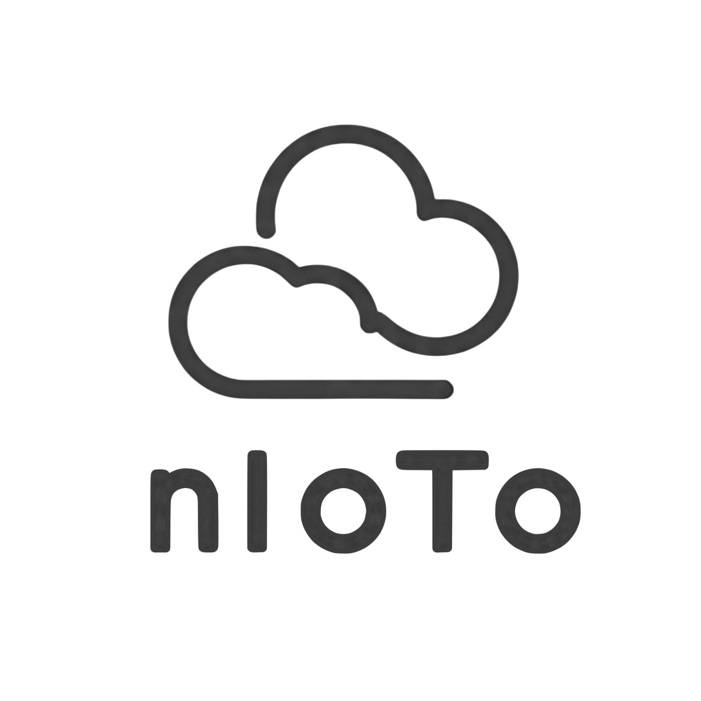

# nIoTo — Open-Source IoT Toolkit

  

> **nIoTo** is a practical, lab-tested toolkit for building IoT systems fast — featuring ESP32 examples, dual-protocol (HTTP/MQTT) pipelines, AWS integrations, sensor data capture, FFT utilities, and ready-to-run sketches.

## Features

- **Dual Mode Operation**
  - **Online Mode**: Real-time data streaming to AWS IoT Core with TLS 1.2 encryption and X.509 certificates.
  - **Offline Mode**: Local data logging to SD card with interactive web-based visualization.

- **Cloud Integration**
  - AWS IoT Core, AWS Lambda, Amazon CloudWatch, and DynamoDB support.
  - Automatic retry logic and data buffering for reliable cloud delivery.
  
- **Versatile Sensor Support**
  - 4× Analog ports (0–3.3V, 12-bit ADC resolution)
  - 4× I²C ports with multiplexer (500 kHz, 3.3V/5V selectable)
  
- **Power & Portability**
  - 3000 mAh Li-ion battery with USB-C charging
  - Config Mode: 80–120 mA, Active Mode: 150–200 mA
  - IP54 enclosure for dust and splash resistance

- **Data Visualization**
  - Built-in Chart.js-powered web dashboard
  - Real-time graphs and historical trends
  - CSV/JSON export options

---

## Quick Start

1. **Power On**
   - Toggle the main switch to **ON**.
   - Wait ~10 seconds for initialization.
2. **Config Mode (Setup)**
   - Connect to Wi-Fi network `nIoTo` (password: `12345678`).
   - Open the IP shown on the LCD in your browser.
   - Enter your Wi-Fi credentials and AWS configuration.
3. **Switch to Active Mode**
   - Double-press the mode button.
   - Device connects to your Wi-Fi and streams data to AWS.

---

## Technical Specs

| Component         | Specification                                         |
|-------------------|-------------------------------------------------------|
| MCU               | ESP32 WROOM, Dual-core LX6, 240 MHz                    |
| Flash             | 4 MB                                                   |
| SRAM              | 320 KB                                                 |
| Connectivity      | Wi-Fi 802.11 b/g/n, Bluetooth Classic + BLE 4.2        |
| Battery           | 3000 mAh Li-ion, USB-C charging                        |
| Ports             | 4× Analog, 4× I²C (multiplexer)                        |
| Storage           | MicroSD up to 128 GB (FAT16/32, exFAT)                  |
| Enclosure         | ABS, IP54, 120×80×35 mm                                 |

---

## Troubleshooting Highlights

- **No Power?**
  - Charge the battery (RED light while charging, GREEN when full).
- **No Wi-Fi?**
  - Ensure in Config Mode; reconnect to `nIoTo` network.
- **No Cloud Data?**
  - Verify AWS IoT Core certificates and Wi-Fi credentials.

---

## Credits

- **Firmware** – Basil Khowaja (ESP32 firmware & AWS integration)
- **Hardware** – Vishal Raj Sundrani (Sensor & Hardware Integration)
- **Academic Guidance** – Sir Tariq Mumtaz, Habib University

---

> _For full setup, advanced configurations, and sensor calibration details, see the_ [IoT Toolkit Manual](word%20IoT%20Toolkit%20Manual%20-%20AWS%20Cloud%20Integration.pdf).
